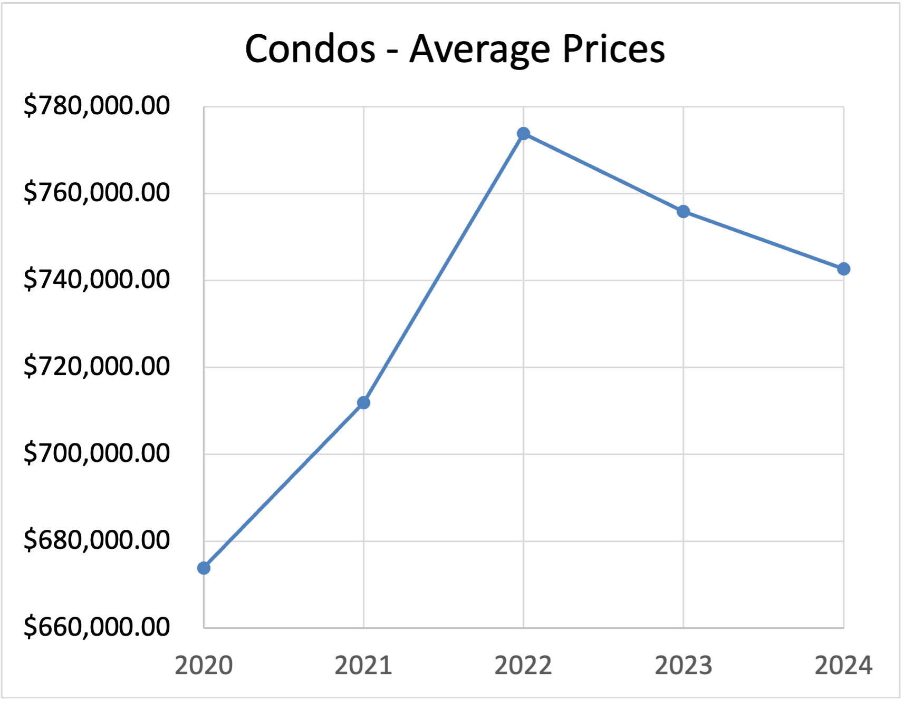
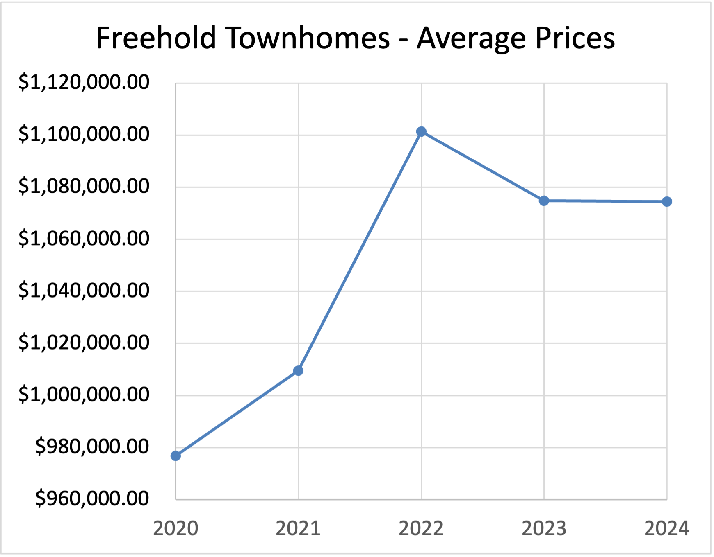

# Introduction

Delve into the Toronto real estate market to understand current trends and potential forecasts through an analysis designed to answer the following questions:

1.  ***Is 2024 a buyer's or seller's market?***

2.  ***How have economic and demographic factors influenced real estate market prices over the past four years?***

 3.  ***What can we forecast for the Toronto real estate market in the next five years?***

Here’s how I approached these questions:

- **Supply and Demand Analysis**: I examined the balance between supply and demand to gauge market pressure.

- **Days on the Market**: I evaluated how long properties stay on the market before being 
sold.

- **Sales-to-Price Ratio**: I assessed the relationship between listing prices and actual sales prices.

- **Residential Unit Price Evolution**: I reviewed how the prices of residential units have changed over the past four years.

- **Demographic and Economic Factors**: I analyzed how demographic shifts and economic conditions influence the real estate market.

- **Forecast Regression Analysis**: I conducted a regression analysis to predict trends in the real estate market for the next five years.

- **Conclusions**: Based on my findings, I drew conclusions about the future direction of the market.

# TOOLS I USED

For my deep dive into the Toronto data analysis real estate market, I harnessed the power of several key tools:

a. **SQL**: The backbone of my analysis, allowing me to query the database and unearth critical insights.

b. **PostgreSQL**: The chosen database management system, ideal for handling the box office data.

c. **Visual Studio Code**: My go-to for database management and executing SQL queries.

d. **Git & GitHub**: Essential for version control and sharing my SQL scripts and analysis, ensuring collaboration and project tracking.

e. **Excel**: A versatile tool for creating graphs and forecasting trends.

## The Analysis

Each query in this text aims to investigate the Toronto (Canada) real estate market from 2020 to 2024(February). I chose Toronto because I am a Torontonian.

# Is 2024 a buyer's or seller's market?

## Supply and Demand Analysis

I rounded the annual totals of house listings (Total_HL) and houses sold (Total_HS) from the market_data table. After filtering for the specified years, I grouped and ordered the data by year in descending order. This made it easy to see yearly trends in listings and sales.

``` sql
SELECT
   EXTRACT(YEAR FROM info_date) AS year,
   ROUND(SUM(House_listing)) AS Total_HL, 
   ROUND(SUM(Houses_Sold)) AS Total_HS 
FROM
   market_data
WHERE
   EXTRACT(YEAR FROM info_date) IN (2020, 2021, 2022, 2023, 2024)
GROUP BY
   EXTRACT(YEAR FROM info_date)
ORDER BY
   year DESC;
```
## Residential Units Listings and Residential Units Sold (Feb 2020-2024)


(This graph was created using Excel). **The numbers in 2024 are significantly lower because they represent only the first two months of the year**.

As we can see from this graph, the number of residential unit listings outnumbers the residential units sold. This indicates that 2024 is a buyer's market.


## Days on the Market

I created an SQL query to calculate the average days on market (DOM) for properties listed from 2020 to early 2024. 

``` sql
SELECT
  AVG(CASE WHEN info_date >= '2020-01-01' AND info_date < '2021-01-01' THEN days_on_market END) AS DOM_2020,
  AVG(CASE WHEN info_date >= '2021-01-01' AND info_date < '2022-01-01' THEN days_on_market END) AS DOM_2021,
  AVG(CASE WHEN info_date >= '2022-01-01' AND info_date < '2023-01-01' THEN days_on_market END) AS DOM_2022,
  AVG(CASE WHEN info_date >= '2023-01-01' AND info_date < '2024-01-01' THEN days_on_market END) AS DOM_2023,
  AVG(CASE WHEN info_date >= '2024-01-01' AND info_date < '2024-03-01' THEN days_on_market END) AS DOM_2024
FROM
  all_properties
WHERE
  days_on_market IS NOT NULL;
```


(This graph was created using Excel). 

As we can see from this graph, the days on the market for all residential units in Toronto have been increasing since 2021, further indicating that 2024 is a buyer's market.

## Sale-to-List Price Ratio

This query helps assess how properties sell relative to their listing prices.

``` sql
SELECT
 info_date,
 TO_CHAR(avg_price, 'FM$999,999,999.00') AS avg_price,
 TO_CHAR(avg_sold_price, 'FM$999,999,999.00') AS avg_sold_price,
 (avg_sold_price / avg_price * 100) AS STL_Price_Ratio
FROM
 all_properties;
 ```
 

 (This graph was created using Excel).

The Sale-to-List Price Ratio has been consistently close to 100%, except for a few exceptional months. A Sale-to-List Price Ratio exceeding 100% means that a residential unit sells for more than its listing price, which typically indicates a seller's market.

## Residential Unit Price Evolution

I wrote an SQL query to calculate average property prices annually from 2020 to 2024.

I did the same for different subcategories: 1. Condos, 2. Condo Townhomes, 3. Freehold Townhomes, 4. Detached Homes.

``` sql
SELECT
   EXTRACT(YEAR FROM info_date) AS year,
   ROUND(SUM(House_listing)) AS Total_HL, 
   ROUND(SUM(Houses_Sold)) AS Total_HS 
FROM
   market_data
WHERE
   EXTRACT(YEAR FROM info_date) IN (2020, 2021, 2022, 2023, 2024)
GROUP BY
   EXTRACT(YEAR FROM info_date)
ORDER BY
   year DESC;
```
 
 
 
 
  
(These graphs were created using Excel)

For all properties, average prices have dropped since 2022. However, the prices for condo townhomes have slightly increased during the same period, indicating that it has been a buyer's market since 2022.

# How have economic and demographic factors influenced real estate market prices over the past four years?

## Prime rates

I created an SQL query to calculate the average prime rate annually from 2020 to 2024.
``` sql
SELECT
   EXTRACT(YEAR FROM info_date) AS year,
   ROUND(AVG(prime_rate), 2) AS Average_PrimeRate 
FROM
   economic_indicators
WHERE
   EXTRACT(YEAR FROM info_date) IN (2020, 2021, 2022, 2023, 2024)
GROUP BY
   EXTRACT(YEAR FROM info_date)
ORDER BY
   year ASC;
```
 
(Image created with ChatGPT4o)

We can observe a significant increase in prime rates starting from 2022, which explains why the average prices of residential units have dropped since then. This rise in prime rates typically results in higher mortgage rates, decreasing home affordability and reducing demand, thus potentially leading to lower residential unit prices.

## GDP Growth Rate Per Year (2020-2023)

I created an SQL query to display and format the annual GDP Growth Rate from 2020 to 2023.
``` sql
SELECT
   EXTRACT(YEAR FROM year) AS year,
   CONCAT(ROUND(AVG(gdp_growth_rate) * 100, 4), '%') AS avg_gdp_growth_rate
FROM
   gdp_growth_peryear
WHERE
   EXTRACT(YEAR FROM year) IN (2020, 2021, 2022, 2023)
GROUP BY
   EXTRACT(YEAR FROM year)
ORDER BY
   year ASC;
```
 

As we can see in the table above, GDP has experienced fluctuations since 2020, with a significant drop in GDP growth that year due to the COVID-19 pandemic. However, it has since stabilized. This stabilization indicates that as people earned more post-pandemic, their ability to afford homes increased, leading to higher demand in the real estate market. Additionally, higher prime rates have been used since 2021 to control inflation, which decreases demand and drives real estate prices down to encourage affordability.

## Unemployment rates 

I wrote a SQL query to analyze and summarize the average unemployment rates for each year from 2020 to 2024. 
``` sql
SELECT
   EXTRACT(YEAR FROM info_date) AS year,
   CONCAT(ROUND(AVG(unemployment_rate), 2), '%') AS Average_UnemploymentRate
FROM
   economic_indicators
WHERE
   EXTRACT(YEAR FROM info_date) IN (2020, 2021, 2022, 2023, 2024)
GROUP BY
   EXTRACT(YEAR FROM info_date)
ORDER BY
   year ASC;
```
 
 
 From 2020 to 2021, during the pandemic, unemployment soared, leading to lower residential unit prices and reduced prime rates. These conditions influenced central bank policies aimed at boosting GDP growth and job creation, directly impacting mortgage rates. Since 2021, as GDP grew, the unemployment rate decreased, and prime rates increased to control inflation, causing real estate prices to drop.

 ## Average salary (2020-2024)

 This query extracts the year from info_date and calculates the average household income for each year from 2020 to 2024 in the demographics table.
 ``` sql
SELECT
  EXTRACT(YEAR FROM info_date) AS year,
  TO_CHAR(ROUND(AVG(household_income), 2), 'FM$999,999,999.00') AS avg_household_income
FROM
  demographics
WHERE
  EXTRACT(YEAR FROM info_date) IN (2020, 2021, 2022, 2023, 2024)
GROUP BY
  EXTRACT(YEAR FROM info_date)
ORDER BY
  year DESC;
```


The average household income (after-tax) from 2020 to 2024 ranges between $74,000 and $76,000. On Ratehub.ca, if you enter these values along with a down payment of $40,000, the maximum home price you can afford is approximately $330,000.

# What can we forecast for the Toronto real estate market in the next five years?

## Forecast Regression Analysis

With regression analysis, we can make assumptions about what the real estate market will be like if it continues to follow the same patterns.

I exported a CSV file containing tables that show the price evolution for all categories of residential units (condos, condo townhomes, townhomes, and detached homes) in Toronto. Then I created an Excel table where I used the forecast formula below for the years 2024-2029.

**=FORECAST.ETS(target_date, values, timeline, [seasonality], [data_completion], [aggregation])**

## All Properties Forecast


The annual increase rates for all property forecasts are as follows:

From 2024 to 2025: **4.75%**
From 2025 to 2026: **2.04%**
From 2026 to 2027: **2.44%**
From 2027 to 2028: **2.30%**
From 2028 to 2029: **2.23%**

## Condos Forecast


The annual increase rates for all condo forecasts are as follows:

From 2024 to 2025: **4.25%**
From 2025 to 2026: **1.49%**
From 2026 to 2027: **2.17%**
From 2027 to 2028: **1.82%**
From 2028 to 2029: **1.81%**

## Condo Townhomes Forecast


The annual increase rates for all townhome forecasts are as follows: 

From 2024 to 2025: **5.81%**
From 2025 to 2026: **3.78%**
From 2026 to 2027: **4.04%**
From 2027 to 2028: **3.79%**
From 2028 to 2029: **3.64%**

## Freehold Townhomes


The annual increase rates for all freehold townhome forecasts are as follows: 

From 2024 to 2025: **3.46%**
From 2025 to 2026: **1.68%**
From 2026 to 2027: **2.23%**
From 2027 to 2028: **1.87%**
From 2028 to 2029: **1.85%**

## Detached Homes


The annual increase rates for all detached home forecasts are as follows: 

From 2024 to 2025: **5.51%**
From 2025 to 2026: **1.41%**
From 2026 to 2027: **2.14%**
From 2027 to 2028: **1.97%**
From 2028 to 2029: **1.90%**

# Conclusion

## Insights

**Supply vs. Demand**: A higher supply than demand suggests that 2024 is a buyer's market.

**Days on Market**: An increase in days on market since 2021 suggests that 2024 is a buyer's market.

**Sales-to-Price Ratio**: A ratio almost always close to 100% suggests that 2024 is a seller's market.

**Residential Unit Price Evolution correlated with economic factors**: There has been a drop in prices since 2022. The pandemic drove an already expensive real estate market to unprecedented levels as prime rates were significantly lowered to make borrowing cheaper and stimulate the economy. Post-pandemic GDP growth and higher prime rates to control inflation have helped temper the real estate market and reduce prices. 

**Real Estate Forecasts for the Next 5 Years**: An increase in real estate prices is expected, with most properties potentially exceeding or getting close to the $1 million mark.

# Observation

- **Most people cannot afford a home in Toronto**. With an average household income (after-tax) **between $74,000 and $76,000**, the maximum house price an average Torontonian can afford is **$330,000**, assuming a down payment of $40,000(calculated with www.ratehub.ca/mortgage-affordability-calculator). However, the average price of a residential unit is **above $900,000**, and even a condo costs around **$750,000**. This disparity explains **why supply significantly exceeds demand**.
  
- **Because most Torontonians cannot afford a home, more people are likely renting**. This could justify why supply exceeds demand, which might have driven the real estate market to lower prices to adapt to market conditions. It also explains why the number of days on the market has significantly increased since the pandemic. When supply exceeds demand and prices are high, there is less urgency to buy quickly. However, the real estate market in Toronto remains hot. Homeowners have little incentive to lower prices if they can rent their property or use it as a long-term investment, especially when prices keep rising.
  
- **The continuous rise in property prices in Toronto is driven by existing homeowners accumulating wealth** through long-term investments, holding properties for optimal economic conditions, and leveraging properties as collateral for further investments. This, combined with limited housing supply and market speculation, maintains high demand and high prices.
